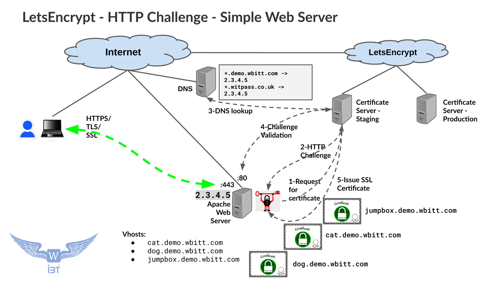
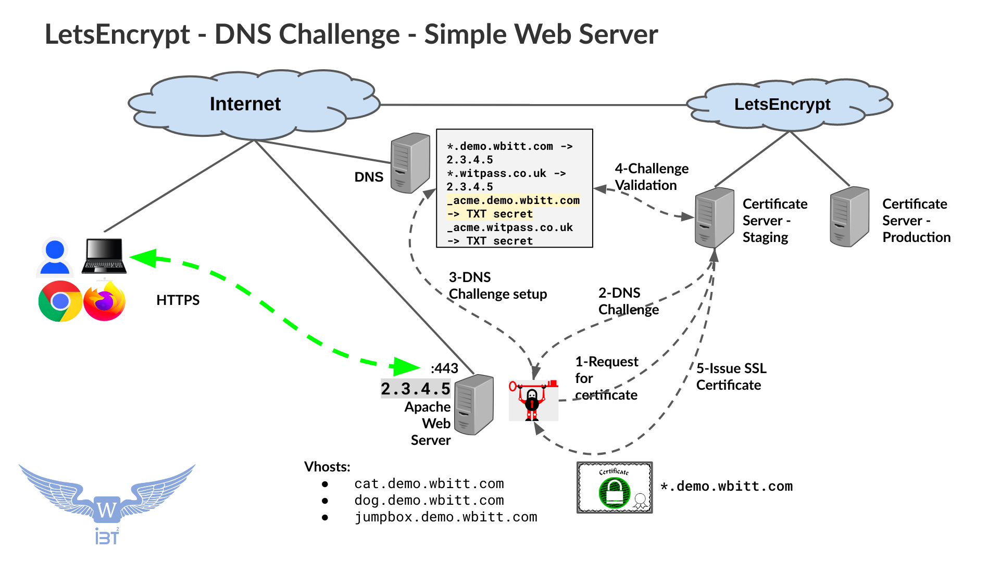
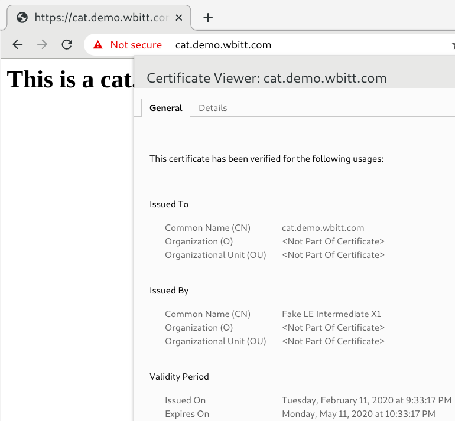
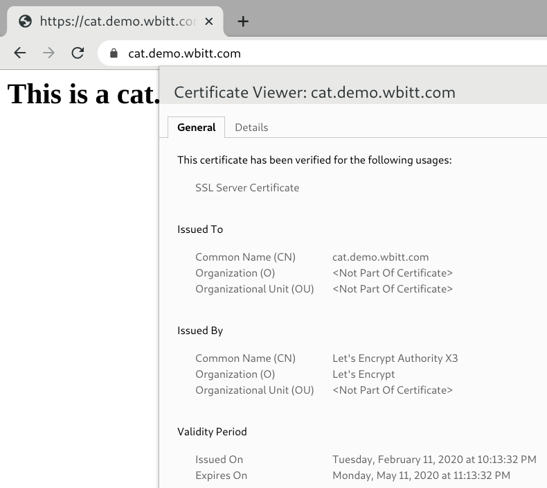
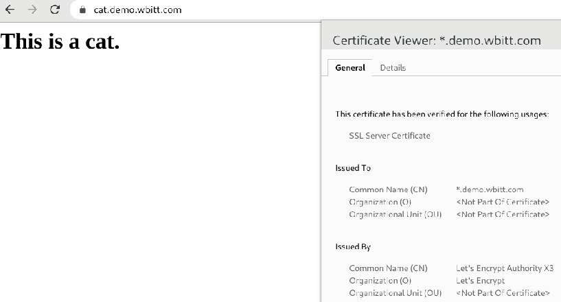
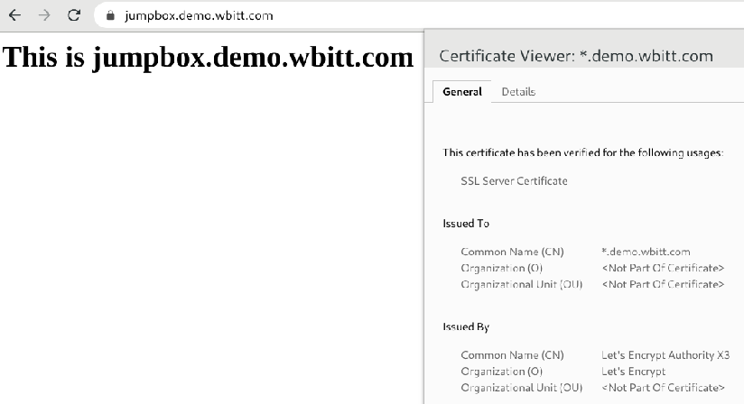

# Learn to use LetsEncrypt

I want to show you how easy it is to use LetsEncrypt to obtain free (and valid) SSL/TLS certificate(s) for your web server - using HTTP and DNS challenges.

Presentation on the same topic can be found [here](https://docs.google.com/presentation/d/1Hf7OLIFVJ3RhTvexMMymiwcbgQ93oYDMkt5NYnENFkE/edit?usp=sharing).

**Note:** This article deals with LetsEncrypt, and does not go into details of how HTTPS protocol works. That is a separate discussion. To learn more about HTTPS and related technologies, you should start from the following articles:

* **HTTPS:** [https://en.wikipedia.org/wiki/HTTPS](https://en.wikipedia.org/wiki/HTTPS)
* **SSL/TLS Certificates:** [https://en.wikipedia.org/wiki/Public_key_certificate](https://en.wikipedia.org/wiki/Public_key_certificate)
* **TLS:** [https://en.wikipedia.org/wiki/Transport_Layer_Security](https://en.wikipedia.org/wiki/Transport_Layer_Security)

## Videos based on this material:
* [[Urdu/Hindi] Introduction to LetsEncrypt - Basics - 1/2 - Theory](https://youtu.be/Glf-EKu6qo4)
* [[Urdu/Hindi] Introduction to LetsEncrypt - Demo - 2/2 - Demo](https://youtu.be/OvQISuaFnX8)
* [[English] Introduction to LetsEncrypt - Basics - Part 1/2 - Theory](https://youtu.be/fqsHCu1CDCs)
* [[English ] Introduction to LetsEncrypt - Demo - Part 2/2 - Demo](https://youtu.be/3jNPSRUBA7Q)

## What is LetsEncrypt:
* The idea to “Lets Encrypt the Internet - for free” became simply: "LetsEncrypt"
* Objective was to lower the complexity of acquiring and setting up SSL certificates for HTTPS
* Original idea/work was done by: Mozilla, EFF, Akamai, University of Michigan and Cisco 
* First certificate issued on 14 Sep 2015 - for the domain [helloworld.letsencrypt.org](helloworld.letsencrypt.org)
* General Availability launch on 12 Apr 2016
* Widely used certificate authority / certificate management system
* Issues "free" certificates, but with validity of 90 days only. You need to renew every 90 days.
* Maintains two certificate environments, **Staging** and **Production**. Staging is used for testing the certificate issuance process. Production is used, when everything is in order.
* LetsEncrypt supports single/individual SSL certificate (`cat.demo.wbitt.com`) , and wild-card SSL certificate (`*.demo.wbitt.com`)
* Supports HTTP-01, DNS-01 and TLS-ALPN-01 challenges
* HTTP Challenge expects a file `http://<YOUR_DOMAIN>/.well-known/acme-challenge/<TOKEN>` placed on your web server
* DNS challenge expects a TXT record in your DNS domain as: `_acme.<YOURDOMAIN> IN TXT secret`
* A LetsEncrypt client e.g. "Certbot", "Nginx", "Traefik", etc, talks to LetsEncrypt servers using ACME protocol. (ACME=Automated Certificate Management Environment)
* For stand alone web servers, Certbot (official LetsEncrypt client), obtains and installs SSL certificates (automatically) for Apache and Nginx web servers - using HTTP challenge. This needs related certbot plugin.
* To obtain wild-card certificate (`*.demo.wbitt.com`) , you will need a DNS plugin related to your DNS provider, as wild-card certificates can only be issued through DNS challenge. Also, DNS plugin does not automatically install SSL certificates to your web server. That part you will need to do manually. It is demonstrated for you in the relevant section of this article.


## How it works? (HTTP and DNS challenges):

A picture is worth a thousand words, so here are two pictures for you:

|  |
| ------------------------------------------------- |
| HTTP Challenge expects a file `http://<YOUR_DOMAIN>/.well-known/acme-challenge/<TOKEN>` |


|  |
| ----------------------------------------------- |
| DNS challenge expects a TXT record in your DNS `_acme.<YOURDOMAIN> IN TXT secret` |


## Prerequisites:
### DNS / Name resolution:
Your DNS server should be configured "100% correctly" for your domain. Without DNS setup correctly, you will experience a lot of pain and frustration. In this example, my domain is "demo.wbitt.com" , hosted on AWS Route53, and I have many hosts under this domain, such as:

* cat.demo.wbitt.com
* dog.demo.wbitt.com
* jumpbox.demo.wbitt.com

For ease of DNS configuration, (and overall ease of setup), I have actually setup a wild-card CNAME record in my DNS zone, which points to `jumpbox.demo.wbitt.com`, only `jumpbox.demo.wbitt.com` has an IP address `3.121.158.211`. So my DNS setup looks like this:

```
*.demo.wbitt.com        IN  CNAME   jumpbox.demo.wbitt.com
jumpbox.demo.wbitt.com  IN  A       3.121.158.211
```

|  |
| ----------------------------------------------------------------- |

This means, that without manually defining individual DNS records for `cat.demo.wbitt.com` or `dog.demo.wbitt.com`, or `rabbit.demo.wbitt.com` for example, I will be able to resolve them to the same IP. Here is how:

```
[kamran@kworkhorse learn-letsencrypt]$ dig +short cat.demo.wbitt.com
jumpbox.demo.wbitt.com.
3.121.158.211

[kamran@kworkhorse learn-letsencrypt]$ dig +short dog.demo.wbitt.com
jumpbox.demo.wbitt.com.
3.121.158.211

[kamran@kworkhorse learn-letsencrypt]$ dig +short rabbit.demo.wbitt.com
jumpbox.demo.wbitt.com.
3.121.158.211

[kamran@kworkhorse learn-letsencrypt]$ dig +short cow.demo.wbitt.com
jumpbox.demo.wbitt.com.
3.121.158.211


(you get the idea ! :)
```

### Necessary software:
I need: 
* certbot
* certbot-apache  - a certbot plugin to install certificates directly in Apache , when using HTTP challenge.
* certbot-dns-route53 - to be able to request and fetch wildcard SSL certificates when using DNS challenge. Not needed if you do not plan to use DNS challenge.

I am using Fedora 29 on my test EC2 instance.

**Notes:** 
* I am using Apache as a web-server (2.4). If you are using Nginx, then use `certbot-nginx` plugin.
* My domain `demo.wbitt.com` is hosted on AWS Route53, that is why I need `certbot-dns-route53` to be installed. You need to install appropriate package for the DNS provider you are using for your domain name. 

```
yum install httpd certbot certbot-apache certbot-dns-route53
```

### Configure Apache correctly:

Configure Apache web server correctly. Make sure that the FQDNs you wish to use to access this web server are setup correctly as `VirtualHosts`. Login to your publicly accessible server:


```
[kamran@kworkhorse ~]$ ssh root@jumpbox.demo.wbitt.com
```
**Note:** I use pass-phrase protected SSH keys to logon to my servers - as root.


```
[root@jumpbox ~]# mkdir -p /var/www/vhosts/{cat,dog,jumpbox}
```

```
[root@jumpbox ~]# cat /etc/httpd/conf.d/vhosts.conf 

<VirtualHost *:80>
    # This is main/actual web server. We don't want any certificates for this one. Still configured correctly as a VirtualHost.
    DocumentRoot "/var/www/html"
    ServerName jumpbox.witpass.co.uk
</VirtualHost>

<VirtualHost *:80>
    DocumentRoot "/var/www/vhosts/jumpbox"
    ServerName jumpbox.demo.wbitt.com
</VirtualHost>

<VirtualHost *:80>
  DocumentRoot "/var/www/vhosts/cat"
  ServerName cat.demo.wbitt.com
</VirtualHost>

<VirtualHost *:80>
  DocumentRoot "/var/www/vhosts/dog"
  ServerName dog.demo.wbitt.com
</VirtualHost>
``` 

Add web content to the files:
```
[root@jumpbox ~]# echo '<h1>This is a cat.</h1>' > /var/www/vhosts/cat/index.html

[root@jumpbox ~]# echo '<h1>This is a Dog!</h1>' > /var/www/vhosts/dog/index.html

[root@jumpbox ~]# echo '<H1>This is jumpbox.demo.wbitt.com</h1>' > /var/www/vhosts/jumpbox/index.html
```

Restart Apache server:
```
[root@jumpbox ~]# systemctl enable httpd
[root@jumpbox ~]# systemctl start httpd
```

### Allow incoming HTTP and HTTPS on the firewall:
I have setup an AWS "Security Group" (assigned to this VM), to allow incoming traffic from `0.0.0.0/0` for port `80` and `443`. Please adjust any firewalls accordingly. Also make sure that the host firewall on the server itself - iptables - allows incoming HTTP and HTTPS traffic. 

It is also a good idea to disable SELinux, which can get in your way. Or, setup correct SELinux context for the /var/www/vhosts/* directories. In that case, you may also need to adjust the SELinux context of the `/etc/letsencrypt` directory, because your SSL certificates will be installed under this directory, and Apache will need correct SELinux context to read the files from this location. (In short, while learning and testing, disable SELinux on your test systems.)


### Make sure you can access the Vhosts over plain HTTP:

```
[kamran@kworkhorse ~]$ curl http://cat.demo.wbitt.com
<h1>This is a cat.</h1>

[kamran@kworkhorse ~]$ curl http://dog.demo.wbitt.com
<h1>This is a Dog!</h1>

[kamran@kworkhorse ~]$ curl http://jumpbox.demo.wbitt.com
<H1>This is jumpbox.demo.wbitt.com</h1>
```


## Get LetsEncrypt Staging certificate using HTTP challenge:

### Do a dry-run to ensure certificate everything is in order:

```
[root@jumpbox vhosts]# certbot certonly  --apache  --dry-run --preferred-challenges=http
Saving debug log to /var/log/letsencrypt/letsencrypt.log
Plugins selected: Authenticator apache, Installer apache

Which names would you like to activate HTTPS for?
- - - - - - - - - - - - - - - - - - - - - - - - - - - - - - - - - - - - - - - -
1: jumpbox.witpass.co.uk
2: cat.demo.wbitt.com
3: dog.demo.wbitt.com
4: jumpbox.demo.wbitt.com
- - - - - - - - - - - - - - - - - - - - - - - - - - - - - - - - - - - - - - - -
Select the appropriate numbers separated by commas and/or spaces, or leave input
blank to select all options shown (Enter 'c' to cancel): 2
Obtaining a new certificate

IMPORTANT NOTES:
 - The dry run was successful.
[root@jumpbox vhosts]# 
```

Next, we get a staging certificate for just one VirtualHost (`cat.demo.wbitt.com`). 

The following will get a staging certificate and will also configure related Apache vhost to use that certificate. It will also restart the Apache service automatically.


### Run certbot to get Staging certificate:
```
certbot run  --apache --test-cert --preferred-challenges=http
```

Actual output:
```
[root@jumpbox ~]# certbot run  --apache --test-cert --preferred-challenges=http
Saving debug log to /var/log/letsencrypt/letsencrypt.log
Plugins selected: Authenticator apache, Installer apache
Enter email address (used for urgent renewal and security notices) (Enter 'c' to
cancel): kamran@wbitt.com

- - - - - - - - - - - - - - - - - - - - - - - - - - - - - - - - - - - - - - - -
Please read the Terms of Service at
https://letsencrypt.org/documents/LE-SA-v1.2-November-15-2017.pdf. You must
agree in order to register with the ACME server at
https://acme-staging-v02.api.letsencrypt.org/directory
- - - - - - - - - - - - - - - - - - - - - - - - - - - - - - - - - - - - - - - -
(A)gree/(C)ancel: A

- - - - - - - - - - - - - - - - - - - - - - - - - - - - - - - - - - - - - - - -
Would you be willing to share your email address with the Electronic Frontier
Foundation, a founding partner of the Let's Encrypt project and the non-profit
organization that develops Certbot? We'd like to send you email about our work
encrypting the web, EFF news, campaigns, and ways to support digital freedom.
- - - - - - - - - - - - - - - - - - - - - - - - - - - - - - - - - - - - - - - -
(Y)es/(N)o: N

Which names would you like to activate HTTPS for?
- - - - - - - - - - - - - - - - - - - - - - - - - - - - - - - - - - - - - - - -
1: jumpbox.witpass.co.uk
2: cat.demo.wbitt.com
3: dog.demo.wbitt.com
4: jumpbox.demo.wbitt.com
- - - - - - - - - - - - - - - - - - - - - - - - - - - - - - - - - - - - - - - -
Select the appropriate numbers separated by commas and/or spaces, or leave input
blank to select all options shown (Enter 'c' to cancel): 2    
Obtaining a new certificate
Performing the following challenges:
http-01 challenge for cat.demo.wbitt.com
Waiting for verification...
Cleaning up challenges
Created an SSL vhost at /etc/httpd/conf.d/vhosts-le-ssl.conf
Deploying Certificate to VirtualHost /etc/httpd/conf.d/vhosts-le-ssl.conf

Please choose whether or not to redirect HTTP traffic to HTTPS, removing HTTP access.
- - - - - - - - - - - - - - - - - - - - - - - - - - - - - - - - - - - - - - - -
1: No redirect - Make no further changes to the webserver configuration.
2: Redirect - Make all requests redirect to secure HTTPS access. Choose this for
new sites, or if you're confident your site works on HTTPS. You can undo this
change by editing your web server's configuration.
- - - - - - - - - - - - - - - - - - - - - - - - - - - - - - - - - - - - - - - -
Select the appropriate number [1-2] then [enter] (press 'c' to cancel): 2
Redirecting vhost in /etc/httpd/conf.d/vhosts.conf to ssl vhost in /etc/httpd/conf.d/vhosts-le-ssl.conf

- - - - - - - - - - - - - - - - - - - - - - - - - - - - - - - - - - - - - - - -
Congratulations! You have successfully enabled https://cat.demo.wbitt.com

You should test your configuration at:
https://www.ssllabs.com/ssltest/analyze.html?d=cat.demo.wbitt.com
- - - - - - - - - - - - - - - - - - - - - - - - - - - - - - - - - - - - - - - -

IMPORTANT NOTES:
 - Congratulations! Your certificate and chain have been saved at:
   /etc/letsencrypt/live/cat.demo.wbitt.com/fullchain.pem
   Your key file has been saved at:
   /etc/letsencrypt/live/cat.demo.wbitt.com/privkey.pem
   Your cert will expire on 2020-05-11. To obtain a new or tweaked
   version of this certificate in the future, simply run certbot again
   with the "certonly" option. To non-interactively renew *all* of
   your certificates, run "certbot renew"
 - Your account credentials have been saved in your Certbot
   configuration directory at /etc/letsencrypt. You should make a
   secure backup of this folder now. This configuration directory will
   also contain certificates and private keys obtained by Certbot so
   making regular backups of this folder is ideal.
[root@jumpbox ~]# 
```

**Note:** Each time certbot runs, it creates a new log file under `/var/log/letsencrypt`. That log file contains all the information about a particular run. The most recent file is always named `letsencrypt.log`. Older files in that directory get a number appended to their name, such as `letsencrypt.log.1` .


**Note:** If you were to be watching server's Apache logs on another terminal  while running the `certbot` command above, you would have seen entries in Apache's `access_log` made by the LetsEncrypt servers, trying to validate the challenge - get a particular file: `/.well-known/acme-challenge/J7YeNAeFBBvSFanwVancARJuINW0q7ADBFSYbSVtf-0` - from four different sources / IP addresses. Since all the HTTP responses are `200`, we can be certain that LetsEncrypt servers were successful in validating that fact that the challenge was setup correctly, and is fulfilled.
```
52.58.118.98 - - [11/Feb/2020:21:33:15 +0000] "GET /.well-known/acme-challenge/J7YeNAeFBBvSFanwVancARJuINW0q7ADBFSYbSVtf-0 HTTP/1.1" 200 87 "-" "Mozilla/5.0 (compatible; Let's Encrypt validation server; +https://www.letsencrypt.org)"
18.224.20.83 - - [11/Feb/2020:21:33:16 +0000] "GET /.well-known/acme-challenge/J7YeNAeFBBvSFanwVancARJuINW0q7ADBFSYbSVtf-0 HTTP/1.1" 200 87 "-" "Mozilla/5.0 (compatible; Let's Encrypt validation server; +https://www.letsencrypt.org)"
66.133.109.36 - - [11/Feb/2020:21:33:16 +0000] "GET /.well-known/acme-challenge/J7YeNAeFBBvSFanwVancARJuINW0q7ADBFSYbSVtf-0 HTTP/1.1" 200 87 "-" "Mozilla/5.0 (compatible; Let's Encrypt validation server; +https://www.letsencrypt.org)"
34.211.60.134 - - [11/Feb/2020:21:33:16 +0000] "GET /.well-known/acme-challenge/J7YeNAeFBBvSFanwVancARJuINW0q7ADBFSYbSVtf-0 HTTP/1.1" 200 87 "-" "Mozilla/5.0 (compatible; Let's Encrypt validation server; +https://www.letsencrypt.org)"
```


Right, so the above `certbot run` resulted in some staging SSL certificate issued for the hostname/FQDN `cat.demo.wbitt.com`. The fact that the certificate came from a staging server, can be checked from the log file:

```
[root@jumpbox ~]# grep 'Sending GET request' /var/log/letsencrypt/letsencrypt.log
2020-02-11 21:32:51,809:DEBUG:acme.client:Sending GET request to https://acme-staging-v02.api.letsencrypt.org/directory.
[root@jumpbox ~]# 
```

List the certificates you have obtained using certbot:

```
[root@jumpbox ~]# certbot certificates
Saving debug log to /var/log/letsencrypt/letsencrypt.log

- - - - - - - - - - - - - - - - - - - - - - - - - - - - - - - - - - - - - - - -
Found the following certs:
  Certificate Name: cat.demo.wbitt.com
    Domains: cat.demo.wbitt.com
    Expiry Date: 2020-05-11 20:33:17+00:00 (INVALID: TEST_CERT)
    Certificate Path: /etc/letsencrypt/live/cat.demo.wbitt.com/fullchain.pem
    Private Key Path: /etc/letsencrypt/live/cat.demo.wbitt.com/privkey.pem
- - - - - - - - - - - - - - - - - - - - - - - - - - - - - - - - - - - - - - - -
[root@jumpbox ~]# 
```

Notice that the certificate says **(INVALID: TEST_CERT)** . 


On Apache's end, you will notice that the `/etc/httpd/conf.d/vhosts.conf` file is updated with SSL directives only for the VirtualHost section for `cat.demo.wbitt.com` : 
```
[root@jumpbox ~]# cat /etc/httpd/conf.d/vhosts.conf 
<VirtualHost *:80>
    # This is main/actual web server. We don't want any certificates for this one. Still configured correctly as a VirtualHost.
    DocumentRoot "/var/www/html"
    ServerName jumpbox.witpass.co.uk
</VirtualHost>

<VirtualHost *:80>
    DocumentRoot "/var/www/vhosts/jumpbox"
    ServerName jumpbox.demo.wbitt.com
</VirtualHost>

<VirtualHost *:80>
  DocumentRoot "/var/www/vhosts/cat"
  ServerName cat.demo.wbitt.com
RewriteEngine on
RewriteCond %{SERVER_NAME} =cat.demo.wbitt.com
RewriteRule ^ https://%{SERVER_NAME}%{REQUEST_URI} [END,NE,R=permanent]
</VirtualHost>

<VirtualHost *:80>
  DocumentRoot "/var/www/vhosts/dog"
  ServerName dog.demo.wbitt.com
</VirtualHost>
[root@jumpbox ~]# 
```


Also, there is a new file named `/etc/httpd/conf.d/vhosts-le-ssl.conf ` ,  which contains a `VirtualHost:443` section for the FQDN, we obtained SSL certificate for. This file contains the actual location of the SSL certificate files, so Apache can use them to serve each VirtualHost over port `443`.

```
[root@jumpbox ~]# cat /etc/httpd/conf.d/vhosts-le-ssl.conf 
<IfModule mod_ssl.c>
<VirtualHost *:443>
  DocumentRoot "/var/www/vhosts/cat"
  ServerName cat.demo.wbitt.com


SSLCertificateFile /etc/letsencrypt/live/cat.demo.wbitt.com/fullchain.pem
SSLCertificateKeyFile /etc/letsencrypt/live/cat.demo.wbitt.com/privkey.pem
Include /etc/letsencrypt/options-ssl-apache.conf
</VirtualHost>
</IfModule>
[root@jumpbox ~]# 
```

### Verify that all this actually works!:
Now we test the certificate on command line and also in browser:

Try reaching the FQDN `cat.demo.wbitt.com` over plain HTTP:

```
[kamran@kworkhorse ~]$ curl http://cat.demo.wbitt.com
<!DOCTYPE HTML PUBLIC "-//IETF//DTD HTML 2.0//EN">
<html><head>
<title>301 Moved Permanently</title>
</head><body>
<h1>Moved Permanently</h1>
<p>The document has moved <a href="https://cat.demo.wbitt.com/">here</a>.</p>
</body></html>
```

The above shows that when we try to reach our hostname / FQDN , we are redirected to HTTPS . Good!


Now we try to reach the HTTPS url:

```
[kamran@kworkhorse ~]$ curl https://cat.demo.wbitt.com
curl: (60) SSL certificate problem: unable to get local issuer certificate
More details here: https://curl.haxx.se/docs/sslcerts.html

curl failed to verify the legitimacy of the server and therefore could not
establish a secure connection to it. To learn more about this situation and
how to fix it, please visit the web page mentioned above.
```

The above basically says that the certificate is invalid, for whatever reason. We know that the reason is simple. This is a Staging certificate, which is supposed to be invalid!

Lets ignore the "invalidity" of the certificate for a moment:
```
[kamran@kworkhorse ~]$ curl -k https://cat.demo.wbitt.com
<h1>This is a cat.</h1>
[kamran@kworkhorse ~]$ 
```

So it works! Lets check it in a browser:

|  |
| --------------------------------------------- |


It works!


## Get Production certificate using HTTP challenge:

Lets delete the existing certificate for `cat.demo.wbitt.com` and get a Production one instead. While we do that, lets get Production SSL certs for the hosts/FQDNs `dog.demo.wbitt.com` and `jumpbox.demo.wbitt.com`. Notice these are Vhosts defined in the `vhosts.conf` file. Note, that even though we can resolve imaginary names for our domain, such as `rabbit.demo.wbitt.com` , certbot will not find a vhost for it, and will not be able to update Apache's configuration for it. So we can only request SSL certificates for the host-names/DNS-names/FQDNs defined explicitly as a VirtualHost. 


### Delete the existing *Invalid* certificate:
This step is actually unnecessary, but shown here for completeness' sake. The reason is, that as soon as you issue a different type of certificate for a FQDN, the certificate files are over-written. 

```
[root@jumpbox ~]# certbot certificates
Saving debug log to /var/log/letsencrypt/letsencrypt.log

- - - - - - - - - - - - - - - - - - - - - - - - - - - - - - - - - - - - - - - -
Found the following certs:
  Certificate Name: cat.demo.wbitt.com
    Domains: cat.demo.wbitt.com
    Expiry Date: 2020-05-11 20:33:17+00:00 (INVALID: TEST_CERT)
    Certificate Path: /etc/letsencrypt/live/cat.demo.wbitt.com/fullchain.pem
    Private Key Path: /etc/letsencrypt/live/cat.demo.wbitt.com/privkey.pem
- - - - - - - - - - - - - - - - - - - - - - - - - - - - - - - - - - - - - - - -
[root@jumpbox ~]# 
```


```
[root@jumpbox ~]# certbot delete
Saving debug log to /var/log/letsencrypt/letsencrypt.log

Which certificate(s) would you like to delete?
- - - - - - - - - - - - - - - - - - - - - - - - - - - - - - - - - - - - - - - -
1: cat.demo.wbitt.com
- - - - - - - - - - - - - - - - - - - - - - - - - - - - - - - - - - - - - - - -
Select the appropriate numbers separated by commas and/or spaces, or leave input
blank to select all options shown (Enter 'c' to cancel): 1

- - - - - - - - - - - - - - - - - - - - - - - - - - - - - - - - - - - - - - - -
Deleted all files relating to certificate cat.demo.wbitt.com.
- - - - - - - - - - - - - - - - - - - - - - - - - - - - - - - - - - - - - - - -
[root@jumpbox ~]# 
```

**Remember;** Deleting certificates using the above command will remove the certificates from the `/etc/letsencrypt/live/cat.demo.wbitt.com/` location, but will not remove the certificate entries from the Apache config files. In this case, you will need to remove the `/etc/httpd/conf.d/vhosts-le-ssl.conf` file before continuing.
```
[root@jumpbox ~]# rm /etc/httpd/conf.d/vhosts-le-ssl.conf 
```


### Run certbot to get Production certificates using HTTP challenge:

Run the command without `test-cert`:
```
[root@jumpbox ~]# certbot run  --apache --preferred-challenges=http
Saving debug log to /var/log/letsencrypt/letsencrypt.log
Plugins selected: Authenticator apache, Installer apache
Enter email address (used for urgent renewal and security notices) (Enter 'c' to
cancel): kamran@wbitt.com

- - - - - - - - - - - - - - - - - - - - - - - - - - - - - - - - - - - - - - - -
Please read the Terms of Service at
https://letsencrypt.org/documents/LE-SA-v1.2-November-15-2017.pdf. You must
agree in order to register with the ACME server at
https://acme-v02.api.letsencrypt.org/directory
- - - - - - - - - - - - - - - - - - - - - - - - - - - - - - - - - - - - - - - -
(A)gree/(C)ancel: A

- - - - - - - - - - - - - - - - - - - - - - - - - - - - - - - - - - - - - - - -
Would you be willing to share your email address with the Electronic Frontier
Foundation, a founding partner of the Let's Encrypt project and the non-profit
organization that develops Certbot? We'd like to send you email about our work
encrypting the web, EFF news, campaigns, and ways to support digital freedom.
- - - - - - - - - - - - - - - - - - - - - - - - - - - - - - - - - - - - - - - -
(Y)es/(N)o: N

Which names would you like to activate HTTPS for?
- - - - - - - - - - - - - - - - - - - - - - - - - - - - - - - - - - - - - - - -
1: jumpbox.witpass.co.uk
2: cat.demo.wbitt.com
3: dog.demo.wbitt.com
4: jumpbox.demo.wbitt.com
- - - - - - - - - - - - - - - - - - - - - - - - - - - - - - - - - - - - - - - -
Select the appropriate numbers separated by commas and/or spaces, or leave input
blank to select all options shown (Enter 'c' to cancel): 2,3,4
Obtaining a new certificate
Performing the following challenges:
http-01 challenge for cat.demo.wbitt.com
http-01 challenge for dog.demo.wbitt.com
http-01 challenge for jumpbox.demo.wbitt.com
Waiting for verification...
Cleaning up challenges
Created an SSL vhost at /etc/httpd/conf.d/vhosts-le-ssl.conf
Deploying Certificate to VirtualHost /etc/httpd/conf.d/vhosts-le-ssl.conf
Created an SSL vhost at /etc/httpd/conf.d/vhosts-le-ssl.conf
Deploying Certificate to VirtualHost /etc/httpd/conf.d/vhosts-le-ssl.conf
Created an SSL vhost at /etc/httpd/conf.d/vhosts-le-ssl.conf
Deploying Certificate to VirtualHost /etc/httpd/conf.d/vhosts-le-ssl.conf

Please choose whether or not to redirect HTTP traffic to HTTPS, removing HTTP access.
- - - - - - - - - - - - - - - - - - - - - - - - - - - - - - - - - - - - - - - -
1: No redirect - Make no further changes to the webserver configuration.
2: Redirect - Make all requests redirect to secure HTTPS access. Choose this for
new sites, or if you're confident your site works on HTTPS. You can undo this
change by editing your web server's configuration.
- - - - - - - - - - - - - - - - - - - - - - - - - - - - - - - - - - - - - - - -
Select the appropriate number [1-2] then [enter] (press 'c' to cancel): 2
Enhancement redirect was already set.
Redirecting vhost in /etc/httpd/conf.d/vhosts.conf to ssl vhost in /etc/httpd/conf.d/vhosts-le-ssl.conf
Redirecting vhost in /etc/httpd/conf.d/vhosts.conf to ssl vhost in /etc/httpd/conf.d/vhosts-le-ssl.conf

- - - - - - - - - - - - - - - - - - - - - - - - - - - - - - - - - - - - - - - -
Congratulations! You have successfully enabled https://cat.demo.wbitt.com,
https://dog.demo.wbitt.com, and https://jumpbox.demo.wbitt.com

You should test your configuration at:
https://www.ssllabs.com/ssltest/analyze.html?d=cat.demo.wbitt.com
https://www.ssllabs.com/ssltest/analyze.html?d=dog.demo.wbitt.com
https://www.ssllabs.com/ssltest/analyze.html?d=jumpbox.demo.wbitt.com
- - - - - - - - - - - - - - - - - - - - - - - - - - - - - - - - - - - - - - - -

IMPORTANT NOTES:
 - Congratulations! Your certificate and chain have been saved at:
   /etc/letsencrypt/live/cat.demo.wbitt.com/fullchain.pem
   Your key file has been saved at:
   /etc/letsencrypt/live/cat.demo.wbitt.com/privkey.pem
   Your cert will expire on 2020-05-11. To obtain a new or tweaked
   version of this certificate in the future, simply run certbot again
   with the "certonly" option. To non-interactively renew *all* of
   your certificates, run "certbot renew"
 - Some rewrite rules copied from /etc/httpd/conf.d/vhosts.conf were
   disabled in the vhost for your HTTPS site located at
   /etc/httpd/conf.d/vhosts-le-ssl.conf because they have the
   potential to create redirection loops.
 - Your account credentials have been saved in your Certbot
   configuration directory at /etc/letsencrypt. You should make a
   secure backup of this folder now. This configuration directory will
   also contain certificates and private keys obtained by Certbot so
   making regular backups of this folder is ideal.
 - If you like Certbot, please consider supporting our work by:

   Donating to ISRG / Let's Encrypt:   https://letsencrypt.org/donate
   Donating to EFF:                    https://eff.org/donate-le

[root@jumpbox ~]# 
```

### Verify:

This time it is enough to check the output of `certbot certificates`: 
```
[root@jumpbox ~]# certbot certificates
Saving debug log to /var/log/letsencrypt/letsencrypt.log

- - - - - - - - - - - - - - - - - - - - - - - - - - - - - - - - - - - - - - - -
Found the following certs:
  Certificate Name: cat.demo.wbitt.com
    Domains: cat.demo.wbitt.com dog.demo.wbitt.com jumpbox.demo.wbitt.com
    Expiry Date: 2020-05-11 21:13:32+00:00 (VALID: 89 days)
    Certificate Path: /etc/letsencrypt/live/cat.demo.wbitt.com/fullchain.pem
    Private Key Path: /etc/letsencrypt/live/cat.demo.wbitt.com/privkey.pem
- - - - - - - - - - - - - - - - - - - - - - - - - - - - - - - - - - - - - - - -
[root@jumpbox ~]# 
```

Notice that LetsEncrypt has issued us one **VALID** certificate which contains all three FQDNs we chose. **Note** This is **not** a wild-card certificate. 


It should be enough to test these certs over SSL and browser:

```
[kamran@kworkhorse ~]$ curl https://cat.demo.wbitt.com
<h1>This is a cat.</h1>

[kamran@kworkhorse ~]$ curl https://dog.demo.wbitt.com
<h1>This is a Dog!</h1>

[kamran@kworkhorse ~]$ curl https://jumpbox.demo.wbitt.com
<H1>This is jumpbox.demo.wbitt.com</h1>
```

Notice, I used `https://` and I got the expected web page, without any SSL errors! Hurray!


Lets have a look at browser too:

|  |
| --------------------------------------------------- |

**Note:** Sometimes browsers cache the web-page and the related content, such as SSL certificates, and you may still see your invalid certificate popping up in browser after you have setup Production certificates. In that case use the "Private Browsing"/"Incognito" mode in a new browser window and try again.


## Certificate renewal:

If you simply run `certbot renew` , it will attempt to renew all your certificates, which are close to becoming expired. When certificates are not due to renew, it just runs, and does noting, thus just a harmless operation.

```
[root@jumpbox ~]# certbot renew
Saving debug log to /var/log/letsencrypt/letsencrypt.log

- - - - - - - - - - - - - - - - - - - - - - - - - - - - - - - - - - - - - - - -
Processing /etc/letsencrypt/renewal/cat.demo.wbitt.com.conf
- - - - - - - - - - - - - - - - - - - - - - - - - - - - - - - - - - - - - - - -
Cert not yet due for renewal

- - - - - - - - - - - - - - - - - - - - - - - - - - - - - - - - - - - - - - - -

The following certs are not due for renewal yet:
  /etc/letsencrypt/live/cat.demo.wbitt.com/fullchain.pem expires on 2020-05-11 (skipped)
No renewals were attempted.
- - - - - - - - - - - - - - - - - - - - - - - - - - - - - - - - - - - - - - - -
[root@jumpbox ~]# 
```

### Auto-renewal of SSL certificates - using cron:
Setup a cronjob to run at some **random time** of the day everyday, or at-least every week. **Not every-month**. Running it monthly would cause your existing certificates to occasionally be expired already, before they get renewed.

```
[root@jumpbox ~]# crontab -e
34 5 * * * /usr/bin/certbot renew --post-hook "systemctl reload httpd"
```


## Get Staging certificates using DNS challenge:
We have seen how we can use Certbot, to obtain both Staging and Production SSL certificates - from LetsEncrypt - using HTTP challenge. It is time to see how we can use DNS challenge to get wild-card certificates.

For this demo, I have done the following preparations:
* Deleted the existing SSL certificates obtained by certbot
* Deleted the conf file `/etc/httpd/conf.d/vhosts-le-ssl.conf`
* Removed all SSL related configurations from the the VirtualHosts in the `/etc/httpd/conf.d/vhosts.conf` file


```
[root@jumpbox ~]# certbot certificates
Saving debug log to /var/log/letsencrypt/letsencrypt.log

- - - - - - - - - - - - - - - - - - - - - - - - - - - - - - - - - - - - - - - -
Found the following certs:
  Certificate Name: cat.demo.wbitt.com
    Domains: cat.demo.wbitt.com dog.demo.wbitt.com jumpbox.demo.wbitt.com
    Expiry Date: 2020-05-11 21:13:32+00:00 (VALID: 89 days)
    Certificate Path: /etc/letsencrypt/live/cat.demo.wbitt.com/fullchain.pem
    Private Key Path: /etc/letsencrypt/live/cat.demo.wbitt.com/privkey.pem
- - - - - - - - - - - - - - - - - - - - - - - - - - - - - - - - - - - - - - - -
[root@jumpbox ~]# 
```

```
[root@jumpbox ~]# certbot delete
Saving debug log to /var/log/letsencrypt/letsencrypt.log

Which certificate(s) would you like to delete?
- - - - - - - - - - - - - - - - - - - - - - - - - - - - - - - - - - - - - - - -
1: cat.demo.wbitt.com
- - - - - - - - - - - - - - - - - - - - - - - - - - - - - - - - - - - - - - - -
Select the appropriate numbers separated by commas and/or spaces, or leave input
blank to select all options shown (Enter 'c' to cancel): 

- - - - - - - - - - - - - - - - - - - - - - - - - - - - - - - - - - - - - - - -
Deleted all files relating to certificate cat.demo.wbitt.com.
- - - - - - - - - - - - - - - - - - - - - - - - - - - - - - - - - - - - - - - -
[root@jumpbox ~]# 
```
**Note:** It is better to revoke the certificate, which will delete it both from the web server, as well as the LetsEncrypt server.

**Note:** During previous testing, certbot expanded the certificate of `cat.demo.wbitt.com` to include `dog` and `jumpbox` certificates. That is why you see this confusing certificate here. 


Remove the `/etc/httpd/conf.d/vhosts-le-ssl.conf` config file and reset the main `/etc/httpd/conf.d/vhosts.conf` file:

```
[root@jumpbox ~]# rm /etc/httpd/conf.d/vhosts-le-ssl.conf 

[root@jumpbox ~]# cat /etc/httpd/conf.d/vhosts.conf 
<VirtualHost *:80>
    # This is main/actual web server. We don't want any certificates for this one. Still configured correctly as a VirtualHost.
    DocumentRoot "/var/www/html"
    ServerName jumpbox.witpass.co.uk
</VirtualHost>

<VirtualHost *:80>
    DocumentRoot "/var/www/vhosts/jumpbox"
    ServerName jumpbox.demo.wbitt.com
</VirtualHost>

<VirtualHost *:80>
  DocumentRoot "/var/www/vhosts/cat"
  ServerName cat.demo.wbitt.com
</VirtualHost>

<VirtualHost *:80>
  DocumentRoot "/var/www/vhosts/dog"
  ServerName dog.demo.wbitt.com
</VirtualHost>
[root@jumpbox ~]# 
```


### Preparation for DNS challenge for domain hosted in AWS Route 53:
DNS challenge requires you/your-web-server to modify the DNS zone in question and fulfill a challenge presented by LetsEncrypt servers. To be able to do this, you need to have certain environment variables setup on the web server, or a file `/root/.aws/config` , containing certain keys - which help you talk to AWS Route53.

**Note:** Please think of security of your AWS account, before setting up your keys as environment variables, or storing them permanently in a file.

The environment variables can be setup as:
```
[root@jumpbox vhosts]# export AWS_ACCESS_KEY_ID=AKIAVTBRLGK7452PUPF
[root@jumpbox vhosts]# export AWS_SECRET_ACCESS_KEY=3nubsd47gtb8eyg7e94ghurihg78Iyf5VLPQjr
``` 

The file can be setup as:
```
[root@jumpbox ~]# cat /root/.aws/config 
[default]
aws_access_key_id = AKIAVTBRLGK7452PUPF
aws_secret_access_key = 3nubsd47gtb8eyg7e94ghurihg78Iyf5VLPQjr
output = text
region = eu-central-1
```

**Note:** The credentials file need to have `0600` permissions.
```
[root@jumpbox ~]# ls -l /root/.aws/config 
-rw------- 1 root root 109 Feb 11 21:26 /root/.aws/config
[root@jumpbox ~]# 
```


### Use certbot to get Staging wild-card SSL certificate: (`*.demo.wbitt.com`)

**Notes:** 
* You cannot use any **Installer** (`--apache` | `--nginx`) when using DNS challenge for wild-card SSL certificate. This means, you will need to configure the Apache/Nginx configurations manually after you obtain the wild-card certificates.
* When using DNS challenge, you can not use the `run` command, instead you can only use `certonly` command.

First lets do a dry run to ensure everything is in order:
```
[root@jumpbox ~]# certbot certonly --dry-run --preferred-challenges=dns --dns-route53  -d *.demo.wbitt.com 
Saving debug log to /var/log/letsencrypt/letsencrypt.log
Credentials found in config file: ~/.aws/config
Plugins selected: Authenticator dns-route53, Installer None
Obtaining a new certificate
Performing the following challenges:
dns-01 challenge for demo.wbitt.com
Starting new HTTPS connection (1): route53.amazonaws.com
Waiting for verification...
Cleaning up challenges

IMPORTANT NOTES:
 - The dry run was successful.
[root@jumpbox ~]# 
```

The `--dry-run` forces certbot to use Staging environment: `https://acme-staging-v02.api.letsencrypt.org/directory` , but it does not actually store any certificate. It is used to verify that DNS challenge is working using the credentials you provided. Notice that no certificates are generated/stored after the `--dry-run`:

```
[root@jumpbox ~]# certbot certificates
Saving debug log to /var/log/letsencrypt/letsencrypt.log

- - - - - - - - - - - - - - - - - - - - - - - - - - - - - - - - - - - - - - - -
No certs found.
- - - - - - - - - - - - - - - - - - - - - - - - - - - - - - - - - - - - - - - -
[root@jumpbox ~]# 
```


Lets pull a wild-card certificate for our domain `demo.wbitt.com` from LetsEncrypt Staging server, using DNS challenge. To obtain the Staging certificates and store them on the disk, replace `--dry-run` with `test-cert`, as shown below:

```
[root@jumpbox ~]# certbot certonly --test-cert --preferred-challenges=dns --dns-route53  -d *.demo.wbitt.com 
Saving debug log to /var/log/letsencrypt/letsencrypt.log
Credentials found in config file: ~/.aws/config
Plugins selected: Authenticator dns-route53, Installer None
Obtaining a new certificate

IMPORTANT NOTES:
 - Congratulations! Your certificate and chain have been saved at:
   /etc/letsencrypt/live/demo.wbitt.com/fullchain.pem
   Your key file has been saved at:
   /etc/letsencrypt/live/demo.wbitt.com/privkey.pem
   Your cert will expire on 2020-05-11. To obtain a new or tweaked
   version of this certificate in the future, simply run certbot
   again. To non-interactively renew *all* of your certificates, run
   "certbot renew"
[root@jumpbox ~]# 
```

This time you see an **INVALID** certificate, issued for `*.demo.wbitt.com` domain:

```
[root@jumpbox ~]# certbot certificates
Saving debug log to /var/log/letsencrypt/letsencrypt.log

- - - - - - - - - - - - - - - - - - - - - - - - - - - - - - - - - - - - - - - -
Found the following certs:
  Certificate Name: demo.wbitt.com
    Domains: *.demo.wbitt.com
    Expiry Date: 2020-05-11 22:14:04+00:00 (INVALID: TEST_CERT)
    Certificate Path: /etc/letsencrypt/live/demo.wbitt.com/fullchain.pem
    Private Key Path: /etc/letsencrypt/live/demo.wbitt.com/privkey.pem
- - - - - - - - - - - - - - - - - - - - - - - - - - - - - - - - - - - - - - - -
[root@jumpbox ~]# 
```

I am skipping the Apache configurations for now. I will do it only once when I get Production wild-card SSL certificate in the next section.


### Use Certbot to get Production wild-card SSL certificate: (`*.demo.wbitt.com`)
Since we see that the Staging certificate is pulled without problems, lets obtain Production wild-card certificate for our domain. 

```
[root@jumpbox vhosts]# certbot certonly  --dns-route53  -d *.demo.wbitt.com
Saving debug log to /var/log/letsencrypt/letsencrypt.log
Found credentials in environment variables.
Plugins selected: Authenticator dns-route53, Installer None
Obtaining a new certificate
Performing the following challenges:
dns-01 challenge for demo.wbitt.com
Starting new HTTPS connection (1): route53.amazonaws.com
Waiting for verification...
Cleaning up challenges

IMPORTANT NOTES:
 - Congratulations! Your certificate and chain have been saved at:
   /etc/letsencrypt/live/demo.wbitt.com/fullchain.pem
   Your key file has been saved at:
   /etc/letsencrypt/live/demo.wbitt.com/privkey.pem
   Your cert will expire on 2020-05-10. To obtain a new or tweaked
   version of this certificate in the future, simply run certbot
   again. To non-interactively renew *all* of your certificates, run
   "certbot renew"
 - If you like Certbot, please consider supporting our work by:

   Donating to ISRG / Let's Encrypt:   https://letsencrypt.org/donate
   Donating to EFF:                    https://eff.org/donate-le

[root@jumpbox vhosts]# 
```


Verify:
```
[root@jumpbox vhosts]# certbot certificates
Saving debug log to /var/log/letsencrypt/letsencrypt.log

- - - - - - - - - - - - - - - - - - - - - - - - - - - - - - - - - - - - - - - -
Found the following certs:
  Certificate Name: demo.wbitt.com
    Domains: *.demo.wbitt.com
    Expiry Date: 2020-05-11 22:20:04+00:00 (VALID: 89 days)
    Certificate Path: /etc/letsencrypt/live/demo.wbitt.com/fullchain.pem
    Private Key Path: /etc/letsencrypt/live/demo.wbitt.com/privkey.pem
- - - - - - - - - - - - - - - - - - - - - - - - - - - - - - - - - - - - - - - -
[root@jumpbox vhosts]# 
```


Now, manually edit the Apache vhost configuration and SSL configuration files. Add the following three Rewrite* commands/directives to `dog.demo.wbitt.com` and `jumpbox.demo.wbitt.com` vhosts in /etc/httpd/conf.d/vhosts.conf file.


```
[root@jumpbox vhosts]# vi /etc/httpd/conf.d/vhosts.conf 
. . . 

<VirtualHost *:80>
  DocumentRoot "/var/www/vhosts/cat"
  ServerName cat.demo.wbitt.com
RewriteEngine on
RewriteCond %{SERVER_NAME} =cat.demo.wbitt.com
RewriteRule ^ https://%{SERVER_NAME}%{REQUEST_URI} [END,NE,R=permanent]
</VirtualHost>

. . . 
```


Then, edit the `/etc/httpd/conf.d/vhosts-le-ssl.conf` file and add a `VirtualHost *:443` section in the way shown below, for each virtual host you have in `/etc/httpd/conf.d/vhosts.conf` file. Since we are using a wild-card certificate, we will use the same path for `fullchain.pem` and `privkey.pem` file in all SSL virtual hosts (`cat`, `dog` and `jumpbox` ) 

```
[root@jumpbox vhosts]# cat /etc/httpd/conf.d/vhosts-le-ssl.conf 
<IfModule mod_ssl.c>
<VirtualHost *:443>
  DocumentRoot "/var/www/vhosts/cat"
  ServerName cat.demo.wbitt.com

SSLCertificateFile /etc/letsencrypt/live/demo.wbitt.com/fullchain.pem
SSLCertificateKeyFile /etc/letsencrypt/live/demo.wbitt.com/privkey.pem
Include /etc/letsencrypt/options-ssl-apache.conf
</VirtualHost>
</IfModule>

<IfModule mod_ssl.c>
<VirtualHost *:443>
  DocumentRoot "/var/www/vhosts/dog"
  ServerName dog.demo.wbitt.com

SSLCertificateFile /etc/letsencrypt/live/demo.wbitt.com/fullchain.pem
SSLCertificateKeyFile /etc/letsencrypt/live/demo.wbitt.com/privkey.pem
Include /etc/letsencrypt/options-ssl-apache.conf
</VirtualHost>
</IfModule>


<IfModule mod_ssl.c>
<VirtualHost *:443>
  DocumentRoot "/var/www/vhosts/jumpbox"
  ServerName jumpbox.demo.wbitt.com

SSLCertificateFile /etc/letsencrypt/live/demo.wbitt.com/fullchain.pem
SSLCertificateKeyFile /etc/letsencrypt/live/demo.wbitt.com/privkey.pem
Include /etc/letsencrypt/options-ssl-apache.conf
</VirtualHost>
</IfModule>


[root@jumpbox vhosts]# 
```

After these modifications, simply restart Apache server:

```
[root@jumpbox vhosts]# systemctl restart httpd
```


### Verify:
Notice that we have our host-names/DNS-names/FQDNs accessible over HTTPS without any SSL errors. The certificate details show a Valid **wild-card** SSL certificate for each FQDN we accessed.

|  |
| ----------------------------------------------------------- |

|  |
| ------------------------------------------------------------------- |


Hurray!


### Auto-renewal of SSL certificates - using cron:
Setup a cronjob to run at some **random time** of the day everyday, or at-least every week. **Not every-month**. Running it monthly would cause your existing certificates to occasionally be expired already, before they get renewed.

```
[root@jumpbox ~]# crontab -e
34 5 * * * /usr/bin/certbot renew --post-hook "systemctl reload httpd"
```


# Certbot's logs:
Surprisingly, the certbot's logs are stored under `/var/log/letsencrypt/`!

```
[root@jumpbox ~]# ls -l /var/log/letsencrypt/
total 248
-rw-r--r-- 1 root root  1705 Feb 11 23:18 letsencrypt.log
-rw-r--r-- 1 root root  1061 Feb 11 23:15 letsencrypt.log.1
-rw-r--r-- 1 root root  1497 Feb 11 22:29 letsencrypt.log.10
-rw-r--r-- 1 root root  1458 Feb 11 22:23 letsencrypt.log.11
-rw-r--r-- 1 root root  1073 Feb 11 22:15 letsencrypt.log.12
-rw-r--r-- 1 root root 49643 Feb 11 22:13 letsencrypt.log.13
-rw-r--r-- 1 root root  4836 Feb 11 22:08 letsencrypt.log.14
-rw-r--r-- 1 root root  1386 Feb 11 22:05 letsencrypt.log.15
-rw-r--r-- 1 root root  1081 Feb 11 21:58 letsencrypt.log.16
-rw-r--r-- 1 root root 34115 Feb 11 21:33 letsencrypt.log.17
-rw-r--r-- 1 root root     0 Feb 11 21:32 letsencrypt.log.18
-rw-r--r-- 1 root root 27088 Feb 11 23:14 letsencrypt.log.2
-rw-r--r-- 1 root root   563 Feb 11 23:13 letsencrypt.log.3
-rw-r--r-- 1 root root 68541 Feb 11 23:08 letsencrypt.log.4
-rw-r--r-- 1 root root  5214 Feb 11 23:04 letsencrypt.log.5
-rw-r--r-- 1 root root  1967 Feb 11 23:00 letsencrypt.log.6
-rw-r--r-- 1 root root   563 Feb 11 22:53 letsencrypt.log.7
-rw-r--r-- 1 root root  1386 Feb 11 22:41 letsencrypt.log.8
-rw-r--r-- 1 root root  1073 Feb 11 22:40 letsencrypt.log.9
[root@jumpbox ~]# 
```


# Revoke certificates:
If you want to **revoke** (remove/invalidate) an already issued certificate from the LetsEncrypt server, you can use the certbot's `revoke` command. Below I have shown how to revoke a Staging wild-card certificate:

```
[root@jumpbox ~]# certbot revoke --staging  --cert-name demo.wbitt.com
Saving debug log to /var/log/letsencrypt/letsencrypt.log

- - - - - - - - - - - - - - - - - - - - - - - - - - - - - - - - - - - - - - - -
Would you like to delete the cert(s) you just revoked, along with all earlier
and later versions of the cert?
- - - - - - - - - - - - - - - - - - - - - - - - - - - - - - - - - - - - - - - -
(Y)es (recommended)/(N)o: Y

- - - - - - - - - - - - - - - - - - - - - - - - - - - - - - - - - - - - - - - -
Deleted all files relating to certificate demo.wbitt.com.
- - - - - - - - - - - - - - - - - - - - - - - - - - - - - - - - - - - - - - - -

- - - - - - - - - - - - - - - - - - - - - - - - - - - - - - - - - - - - - - - -
Congratulations! You have successfully revoked the certificate that was located
at /etc/letsencrypt/live/demo.wbitt.com/fullchain.pem

- - - - - - - - - - - - - - - - - - - - - - - - - - - - - - - - - - - - - - - -
[root@jumpbox ~]# 
```

```
[root@jumpbox ~]# certbot certificates
Saving debug log to /var/log/letsencrypt/letsencrypt.log

- - - - - - - - - - - - - - - - - - - - - - - - - - - - - - - - - - - - - - - -
No certs found.
- - - - - - - - - - - - - - - - - - - - - - - - - - - - - - - - - - - - - - - -
[root@jumpbox ~]# 
```

# Further reading:
* [https://en.wikipedia.org/wiki/HTTPS](https://en.wikipedia.org/wiki/HTTPS)
* [https://en.wikipedia.org/wiki/Public_key_certificate](https://en.wikipedia.org/wiki/Public_key_certificate)
* [https://en.wikipedia.org/wiki/Transport_Layer_Security](https://en.wikipedia.org/wiki/Transport_Layer_Security)
* [https://letsencrypt.org/how-it-works/](https://letsencrypt.org/how-it-works/)
 

This concludes this article.
